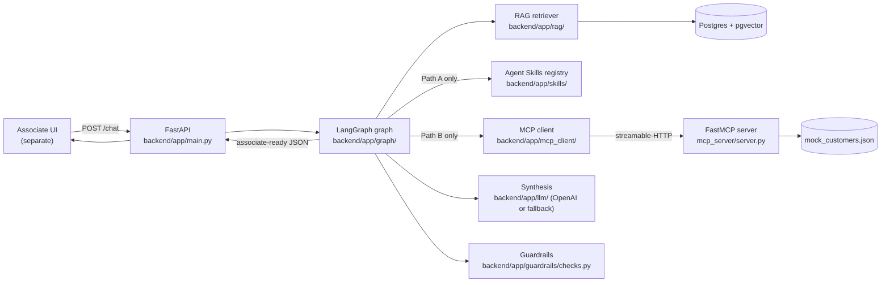

# Architecture

## 1. Purpose and framing

This is the backend for an **internal Fidelity associate copilot** for retirement
servicing. Three roles matter:

- **Associate** — the internal Fidelity user, and the *only* user of this system.
- **Customer** — the person the associate is helping (e.g. Robert Miller).
- **Copilot** — produces an *associate-ready* response. It does **not** talk to the
  customer autonomously, does **not** give investment/tax advice, and does **not**
  move money or execute trades.

It implements the **front-door router** from the broader product design (see the
`fidelity-servicing-copilot*.html` decks) and both downstream paths:

- **Path A — Augmented LLM · RAG + Agent Skills · no customer data.** A low-friction
  augmented LLM for *general* rollover questions. Inputs are the associate query, the
  approved **RAG** knowledge base, and a set of **Agent Skills**. It calls **no
  MCP/customer-data tools**, has **no human-in-the-loop** steps, and auto-runs
  straight to a reviewable draft ("Submit for Review").
- **Path B — Controlled Prompt Chain · RAG + MCP customer data · guardrail checkpoints.**
  For *customer-specific* rollover work. A fixed chain retrieves RAG context, calls the
  read-only **MCP** customer tools, validates the customer, drafts the response, and runs
  guardrails — showing a **human-in-the-loop review** UI when flags/escalations exist.

Both paths converge on the same deterministic safety checks. The system never executes
transactions, moves money, or gives investment/tax/legal advice — the final output is a
reviewable draft the associate owns, not direct customer communication.

## 2. Component map



## 3. The graph (router + two paths)

`backend/app/graph/workflow.py` compiles a LangGraph `StateGraph` over
`CopilotState` (`graph/state.py`). A deterministic **router** (`classify_request` +
`_route_path`) dispatches to Path A or Path B; both converge on the shared
guardrails + formatter.

```
parse → classify(ROUTER) → retrieve_rag → _route_path
                                               │
   Path A (rollover + general):    pa_gate → pa_explain → pa_build_checklist
     Augmented LLM: RAG + Agent Skills, no MCP    │                 │
   Path B (rollover + customer):   decide_tools → call_tools → synthesize
     Controlled Prompt Chain: RAG + MCP tools     │                 │
                                  guardrails_check → format_final_response (END)
   (clarification short-circuits → format at pa_gate / decide_tools / call_tools)
```

Shared nodes (`graph/nodes.py`):
1. **parse_user_request** — regex-extract `CUST-####` id / customer name / rollover keywords.
2. **classify_request (ROUTER)** — deterministic; sets `classification["path"]`: rollover+general→`A_augmented_llm`, rollover+customer-specific→`B_prompt_chain`, else→`other`.
3. **retrieve_rag_documents** — pgvector cosine top-k over the approved corpus; always runs (both paths are grounded).

Path A nodes (`graph/path_a.py`) — Augmented LLM (RAG + Agent Skills, **no MCP**):
4a. **pa_gate** — deterministic validation gate: fail-fast if no RAG chunks; runs the `clarification_detector` Agent Skill (off-ramp if the question is too sparse); else pick a sub-topic.
5a. **pa_explain** — the `rollover_response_style` Agent Skill (LLM + fallback): plain-language, cited explanation.
6a. **pa_build_checklist** — the `pa_checklist` skill (standard next-steps + required forms) then the `customer_language_policy` Agent Skill (shapes the draft in approved language); assembles the synthesis dict. **No MCP tools** (`tools_called: []`). No human-in-the-loop — auto-runs to a reviewable draft.

Path B nodes (`graph/nodes.py`) — Controlled Prompt Chain (RAG + MCP + guardrail checkpoints):
4b. **decide_required_tools** — queue the 6 read tools if customer-specific; else flag clarification.
5b. **call_mcp_tools** — call each fixed tool over MCP; validate customer found / missing data; if the profile isn't found, flag clarification.
6b. **synthesize_rollover_plan** — OpenAI (or deterministic fallback) turns RAG + live tool data into the structured draft.

Shared tail:
7. **guardrails_check** — deterministic safety pass (below). For Path A, empty tool data ⇒ no escalation (low-friction). For Path B, restrictions/disputes/etc. in the customer data trigger a **human-in-the-loop review**.
8. **format_final_response** — assemble the API payload (incl. `path`); guardrails own the authoritative compliance notes, redacted draft, sources, and escalation decision.

Every node appends to `state["trace"]`, surfaced to the UI in `response.trace.steps`.

**Why deterministic classification/orchestration?** This is a *workflow*, not an
agent: the engineer fixes the path and the model only fills in content at the
synthesis node. That keeps the system auditable and reproducible — important for a
compliance-sensitive domain.

## 4. RAG vs. MCP — the core distinction

These are deliberately separate and are the main teaching point of the demo:

| | **RAG** | **MCP tools** |
|---|---|---|
| **Question it answers** | "What does *approved policy* say?" | "What is true about *this customer*?" |
| **Content** | Static, approved guidance (SOPs, forms, tax boundaries, escalation policy) | Live, per-customer/system data |
| **Shape** | Unstructured text, chunked + embedded | Structured records returned by typed tools |
| **How it's reached** | Vector similarity search (`embedding <=> query`) | Explicit tool call by name with args |
| **Cited?** | Yes — every chunk has a stable id (`ROLLOVER-SOP-01`) and shows up in `rag_sources` | Tracked in `tools_called` + raw in `trace.tool_results` |
| **Source of truth** | `data/rag_docs/*.md` → `rag_chunks` table | `mcp_server/data/mock_customers.json` |
| **Changes when…** | Policy is updated and re-ingested | A customer's account state changes |

In short: **RAG grounds the answer in what Fidelity is *allowed to say*; MCP grounds
it in what is *true for this customer*.** **Path A** (general questions) uses RAG +
Agent Skills only and calls *no* MCP tools — which is exactly why its response shows
`tools_called: []`. **Path B** (customer-specific) reasons over *both* RAG and live MCP
data. The guardrails make sure either result stays inside policy.

> **Agent Skills vs. RAG.** Approved customer-facing language is a *policy the copilot
> applies to its own output*, not knowledge it retrieves — so it lives as the
> `customer_language_policy` **Agent Skill** (`backend/app/skills/agent_skills/*.md`),
> **not** in the RAG corpus. The remaining approved guidance documents (SOP, forms,
> tax boundaries, escalation policy, IRA opening) stay in RAG.

### RAG pipeline
- **Embeddings** (`rag/embeddings.py`): local `sentence-transformers` when installed,
  else a deterministic hashed bag-of-words embedding of the same dimension (384).
  Both are L2-normalized so pgvector cosine distance is meaningful.
- **Store** (`rag/vector_store.py`): a `rag_chunks(chunk_id, doc_name, content, embedding vector(384))`
  table; cosine search via the `<=>` operator.
- **Ingest** (`rag/ingest.py`): split each markdown doc on `##` headings → stable chunk
  ids → embed → upsert (table truncated first, so re-ingest is safe).

This is the "swapped-in" version of the in-memory token-overlap stub in the sibling
`ai-orchestration-patterns/.../03-skills-mcp-rag` example.

### MCP tools (`mcp_server/`)
FastMCP over streamable-HTTP, 7 tools:
`get_customer_profile`, `check_existing_ira`, `list_retirement_accounts`,
`get_source_plan_details`, `check_account_restrictions`, `get_document_or_case_status`,
and `create_or_update_service_case` (**dry-run only** — returns a simulated case id).

## 5. Guardrails (lightweight, deterministic)

`backend/app/guardrails/checks.py` is a *code-only* safety layer (so model output
cannot argue its way past it). It enforces:

- **No personalized investment advice** — flag/neutralize "you should invest / allocate X%".
- **No unsupported tax/legal advice** — flag tax-outcome claims; defer to a tax professional.
- **No trade execution / money movement** — flag "execute the trade / move your funds".
- **PII redaction** — SSN, account numbers, email, phone redacted from the *customer-facing draft* (the associate still sees raw values in `findings`/`trace`).
- **Grounding** — ensure `rag_sources` is populated.
- **Escalation** — `determine_escalation()` computes reasons from MCP data. Escalate on
  restrictions, beneficiary dispute, fraud/KYC, outstanding plan loan, unknown/disallowed
  rollover eligibility, incomplete identity verification, or missing system data. *Missing
  IRA-application / rollover-request forms are normal next steps, not escalation triggers* —
  this is what makes CUST-1001 clean and CUST-2002 escalate.

## 6. Synthesis backends

`backend/app/llm/client.py` exposes one `synthesize(...)` with two interchangeable
backends and an identical output schema:
- **Live**: OpenAI (`gpt-4o-mini` by default) when `OPENAI_API_KEY` is set.
- **Fallback**: a deterministic template synthesizer (no key, fully offline).

`/health` reports which mode is active (`model_mode`).

## 7. Built vs. still scaffolded

- ✅ **Path A — Augmented LLM** (RAG + Agent Skills, no MCP) — `graph/path_a.py` +
  `skills/` (`clarification_detector`, `rollover_response_style`, `customer_language_policy`).
- ✅ **Router + Path B — Controlled Prompt Chain** (RAG + MCP + guardrail checkpoints) —
  `graph/nodes.py`, dispatched by `classify_request` + `workflow._route_path`.
- ✅ **Agent Skills registry + validation chain** (`backend/app/skills/`): versioned skills
  (content + validation) logged to a `skills_used` audit trail; approved customer language
  now lives as a markdown Agent Skill (`skills/agent_skills/customer_language_policy.md`).

## 8. Folder reference

```
backend/app/
  main.py            FastAPI endpoints
  config.py          env-driven settings
  graph/             state.py, nodes.py (shared + Path B MCP chain), path_a.py (Path A skills chain), workflow.py
  rag/               embeddings.py, vector_store.py, ingest.py, retriever.py
  skills/            registry.py, builtin.py, agent_skills/*.md (Agent Skills)
  mcp_client/        client.py (streamable-HTTP)
  guardrails/        checks.py
  llm/               client.py (OpenAI + fallback)
  schemas/           api.py (Pydantic contract)
  future/            prompt_chain.py (status marker: both paths + skills done)
mcp_server/          server.py + tools/ + data/mock_customers.json
data/rag_docs/       5 approved guidance docs (customer language is now an Agent Skill)
scripts/             seed_mock_data.py, ingest_docs.py, smoke_test.sh
docker-compose.yml   Postgres + pgvector
```
